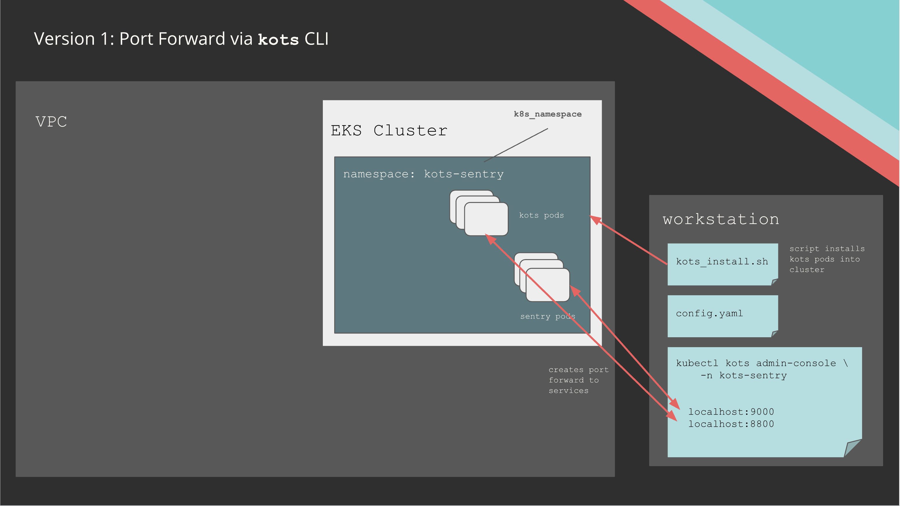
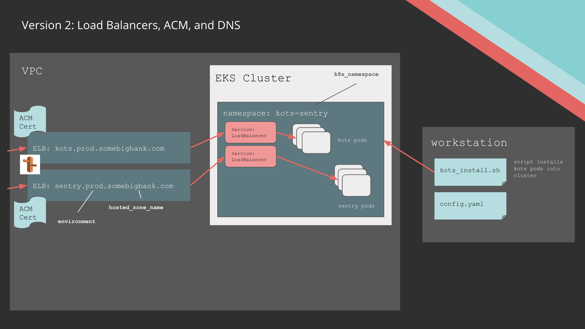

## Architecture

This example uses the `terraform-kots-eks` module to deploy KOTS sentry. 
Review variables.tf to understand what can be customized.

#### VPC

This example creates a VPC. 
Deployment to an existing VPC is also possible.

### Ingress

There are primary modes of managing access to web services,
controlled by the variable `create_lbs_dns_certs`.

#### Option 1: Port forward

If `create_lbs_dns_certs` is set to false, port forwards can be used post-install to access kots and sentry.
The idea behind this approach is that a cluster operator may want to configure DNS, certs, load balancers, etc
at a later time post-install.
Port forwarding allows for quick and easy verification that services are up and running via 

```
export NAMESPACE=kots-sentry # set to value of variable `k8s_namespace`
kubectl kots admin-console -n $NAMESPACE
```




#### Option 2: Load Balancers

If `create_lbs_dns_certs` is set to true, a full stack of Load Balancers, DNS names, and and ACM
certificates will be provisioned in the Route53 zone specified by `hosted_zone_name`.

```
https://kots.$environment.$hosted_zone_name
https://sentry.$environment.$hosted_zone_name
```




## Running it

#### Creating a Key Pair

Your key-pair should match the `namespace` and `environment` variables you pass in.
If you're using `somebigbank` and `prod` respectively, then your key name should be
`somebigbank-prod`.

```
aws --region=ca-central-1 ec2 create-key-pair --key-name somebigbank-prod
```

and save the private key somewhere.

#### Installing KOTS

*Reccomended* The `terraform apply` step will invoke a script to install kubect-kots on your workstation, which will prompt for a sudo password to copy the `kubectl-kots` binary to /usr/local/bin. *If you want* you can pre-install kots CLI, either manually from https://github.com/replicatedhq/kots/releases or with

```shell
curl https://kots.io/install | bash
```

#### Terraform Apply

Run the terraform with

```
terraform init
terraform apply
```


### Troubleshooting

This has only been tested end to end with terraform 0.13.7 -- you may be able to work around 
M1 mac issues by using that version.
